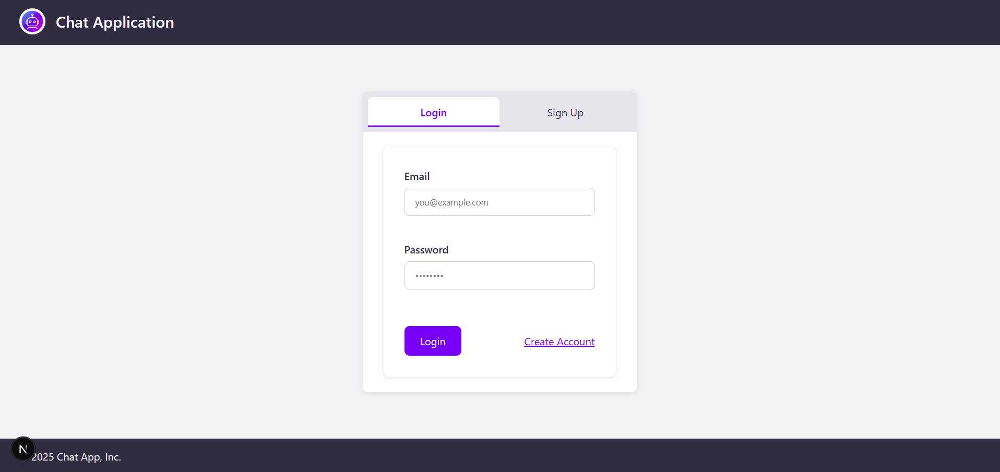
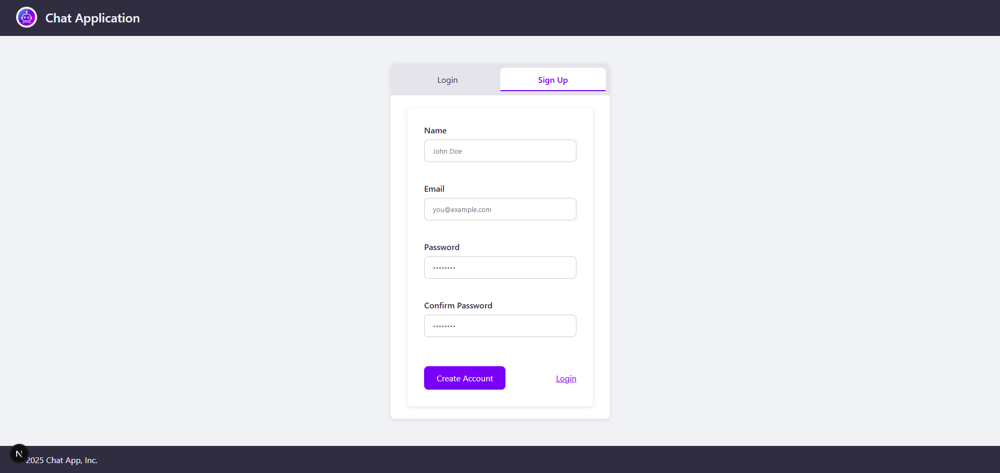
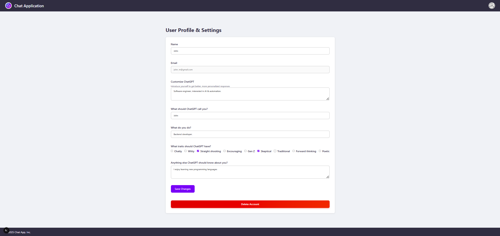
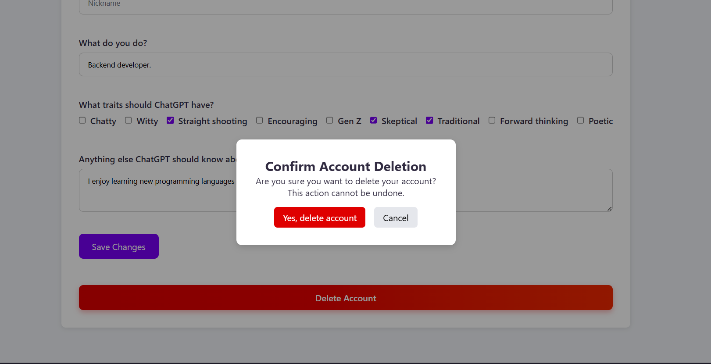
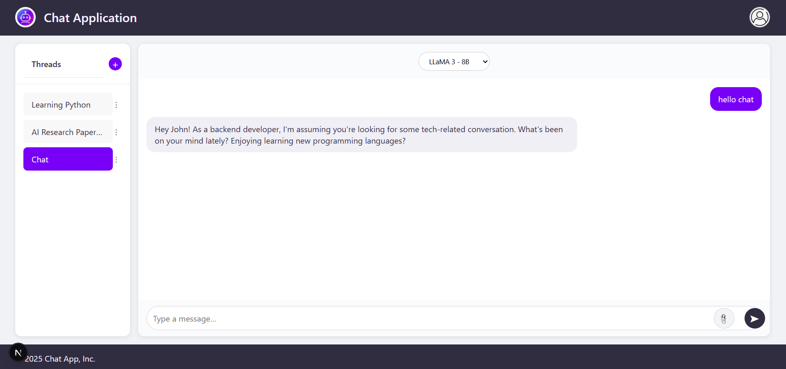
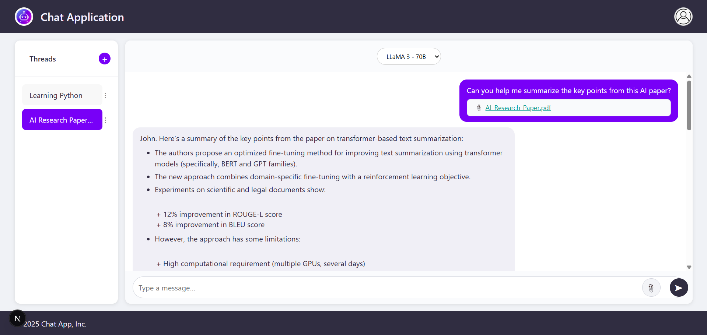
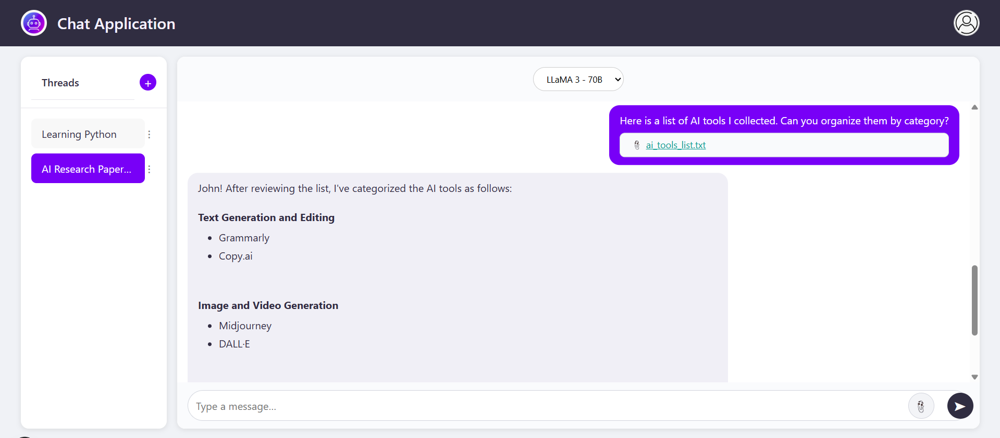

# ChatGPT Project (Java Spring Boot + React)

A full-stack ChatGPT-like application built as part of the Java Spring Bootcamp.  
Backend: Java + Spring Boot + PostgreSQL  
Frontend: React + Next.js  

---

## ✨ Features

-  User Registration & Login (JWT Auth)
-  Account Management (view / update profile, delete account)
-  Create / Rename / Delete Chat Threads
-  Send Messages in each Thread
-  Select LLM model (Groq API simulation - LLaMA / Mixtral)
-  Upload Files (PDF / TXT) with message
-  Responsive and clean UI
-  Global error handling with user-friendly messages

---

##  Screenshots

### 1️⃣ Login Page
_User authentication with JWT token stored in localStorage_


### 2️⃣ Sign Up Page
_New users can register with profile information_


### 3️⃣ Account Page
_View and update profile, delete account with confirmation modal_




### 4️⃣ Chat Page
_Main Chat interface with:_
- Thread list (create / rename / delete threads)
- Chat window with message history
- LLM model selector
- Upload PDF/TXT support
- Auto-scroll on new message
- Auto-create thread on first message






---

## 🗂️ Pages overview

| Page | Description |
|------|-------------|
| `/login` | User login |
| `/signup` | User registration |
| `/account` | Manage user profile & delete account |
| `/chat` | Main chat UI, message threads, message sending |

---

## 🛠️ API Overview

### User API

| Method | Endpoint        | Description                           |
|--------|-----------------|---------------------------------------|
| POST   | `/login`        | User login (Basic Auth → JWT token)    |
| POST   | `/signup`       | User registration                     |
| GET    | `/users/me`     | Get current user profile               |
| PUT    | `/users/me`     | Update current user profile            |
| DELETE | `/users/me`     | Delete current user account            |

### Thread API

| Method | Endpoint               | Description                         |
|--------|------------------------|-------------------------------------|
| GET    | `/threads/user/me`     | Get all threads for current user    |
| POST   | `/threads`             | Create new thread                   |
| PUT    | `/threads/{threadId}`  | Rename thread                       |
| DELETE | `/threads/{threadId}`  | Delete thread                       |

### Message API

| Method | Endpoint                        | Description                        |
|--------|---------------------------------|------------------------------------|
| GET    | `/messages/thread/{threadId}`    | Get all messages in a thread       |
| POST   | `/messages`                     | Send text message in a thread      |
| POST   | `/messages/upload`              | Send message with PDF/TXT file upload |


---

## ⚙️ Technologies Used

- **Backend:** Java 21 + Spring Boot 3.x
  - Spring Security
  - JWT Auth
  - JPA / Hibernate
  - PostgreSQL
  - Global Exception Handling
- **Frontend:** React + Next.js (Pages Router)
  - Plain CSS / Flexbox / Responsive design
  - Fetch/Axios API with JWT Bearer Token
  - React Hooks (useEffect, useState, useRef)
  - Modals, File Upload
- **Database:** PostgreSQL
  - Auto-migrations via Hibernate
  - Cascade delete (Threads, Messages, UserTraits)
- **Other:** IntelliJ Ultimate + pgAdmin

---

## 🚀 How to run locally

### Backend (Spring Boot)

```bash
# Use IntelliJ Run
```

### Frontend (React + Next.js)

```bash
# In chatgpt_frontend folder:
npm install
npm run dev
# App will run at http://localhost:3000
```
